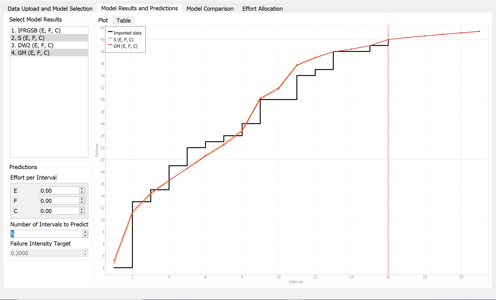
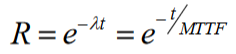

**SENG 438- Software Testing, Reliability, and Quality**

**Lab. Report \#5 – Software Reliability Assessment**

| Group \#: 33       |   |
|-----------------|---|
| Student Names:  |   |
| Lucas Ion                |   |
| Nguyen Gia Hy Huynh                |   |
| Hao Nguyen                |   |
| Alden Lien                |   |

# Introduction
In this lab we were tasked with using and comparing two ways to analyze failure rates. For this lab the two tools we needed to use were C-SFRAT and an RDC Chart.
# 

# Assessment Using Reliability Growth Testing 

For this assessment, our team choose C-SFRAT as our tool. C-SFRAT provided us with variety of Hazard Functions such as: IFR Salvia & Bollinger (IFRSB), IFR Generalized Salvia & Bollinger (IFRGSB), S Distribution (S), Discrete Weibull (Order 2) (DW2), Discrete Weibull (Type III) (DW3), Geometric (GM), Negative Biominal (NB2), and Truncated Logistic(TL)

## Model Comparision

First of all, we chose the best 4 Hazard Functions based on their description and their fuctionality. These 4 Hazard Functions are IFRGSB, S, DW2, and GM.
Reason why we pick 4 of these functions among the rest:

	- Increasing Failure Rate (IFR) function that describes the increasing trend behavior of the number of failure as time increases. The use of this hazard function fits with our demand because as observing the given data, the number of failure is in an increasing trend.
	- S-Distribution is used for case that has standard normally distributed lesser than 0.5 or with small data. And our given data is considered as a small set of that where z-scores should not be too high.
	- Geometric Distribution displays the probability distribution of number of failures before the first success. This can be applied in our case because we have cases where the Failure Counts (FC) is zero and that point marks the first success.
	- Discrete Weibull are used to describe various types of observed failures of components and phenomena. They are widely used in reliability analysis therefore it should be a good fit in our situation. 

Next, we will graph those 4 Hazard Functions on C-SFRAT like the following images:

Based on the Model Comparison table, we observed that the Log-Likelihood column is ranking in the ascending order as following: DW2, IFRGSB, GM, and S. And as we know, likelihood method is a measure of how well a particular model fits the data. Thus, the higher the value, the better the model would be accurate corresponding to our original inputs. As a result, we pick Geometric Distribution and S Distribution as the two main models for our next analysis step. 

## Result of Range Analysis

Based on Intensity Graph, the group believed failure datas from interval 6 to interval 12 are the best fit for Range Analysis. The reason we chose this subset of the data because we believe it will give us the most stable reliability and stable growth. 

## Plots for failure rate and reliability of the SUT for the test data provided

This is the plot for failure rate at range 6th to 12th interval. (38.061 - 14.577)/(12-6) = 3.914 failures/interval
The slope of the plot describes for every interval of time unit, there are 3.914 new failures discovered in average. 

This is the plot of intensity failures. The reason why are using this is that C-SFRAT does not support the reliability failures graph. However, it can be derived from the intensity failures. In observation, the peak of intensity is at the 9th interval where the value is hike upto 8.116 falures, which also means this is where the program has the lowest reliability. Whereas, at 6-7th interval, there are only approximate 2 failures, thus, they have highest reliabilty scores. 

## A discussion on decision making given a target failure rate

With MTTF (Average failure rate), we can use it to calculate System Reliabilty by the formula:

The result is the slope can be used to estimate two things: 
- The remaining bugs haven't been identified. By extending the original `Failure rate versus Number of failure graph` with this slope we can achieve the number of total bugs of the original failures at the x-intercept. 
- The remaining runtime needed to remove all the bugs. By extending the original `Failure rate versus Time graph` with this slope we can achieve the number of end time that all bugs are removed at the x-intercept.
With these information, the team can debate whether they should continue with the current SUT or stop the process to improve the SUT. Decision will depend on the resources allowance.

## A discussion on the advantages and disadvantages of reliability growth analysis 

- Advantages: 
	+ Reliability Growth Testing produces visuallized graphs that shows the failure rates (relationship between failure to time intervals), which are important when 	developing a product.
	+ RTG is also used to predict the data behaviour in the future to provide us information for making decisions on the product. Specifically, we can use the 	average failure rates in a range of intervals to calculate the System Reliabilty which is used to identify the remaining bugs and remaining time that is needed 	to remove the excessive bugs. 
	+ RTG allows us to backtrack the causes of system failures by identifying the highest failure peaks. 
- Disavantages:
	+ It depends on large number of fail cases in order to be accurate.
	+ There can be a lot of noisy data when analysising the inputs and drawing the graphs.
	+ The graphs are difficult to understand and need high-level knowledge in statistic and quality assurance to utilize it 

# Assessment Using Reliability Demonstration Chart 

The RDC chart uses colour coding to indicated wheter or not the observed faliures of the SUT has reached the failure intensity objective. The RED region indicates that is has not, and must be rejected. The YELLOW indicates that more tests are needed to conclusivley establish the result, and the GREEN zone indicates that SUT will meet the failure intensity objective. There are various variables which can determine these boundries.

# **Half MTTFmin**

For the graph above in order to effectively determine the MTTFmin, we had to observe the point on the graph which corresponds to every other point to the right of it being in the green region. 

By observing this graph it is quite clear that there is no point where everything to the right of it is in the green "Accept" region, therefore for this graph we accertain that **MTTFmin cannot be concluded**
.
# **MTTFmin**

For the graph above in order to effectively determine the MTTFmin, we had to observe the point on the graph which corresponds to every other point to the right of it being in the green region. 

By observing this graph it is quite clear there is one point which distinctly marks where that corresponding region is. For this graph, the **MTTFmin is 6.12** as that is the first point on the x-axis that has everything to the right of it being in the greeen. Notice that the point to left of 6.12 is on the cusp and is therefore not counted

# **Double MTTFmin**

For the graph above in order to effectively determine the MTTFmin, we had to observe the point on the graph which corresponds to every other point to the right of it being in the green region. 

By observing this graph it is quite clear there is one point which distinctly marks where that corresponding region is. For this graph, the **MTTFmin is 6.31** as that is the first point on the x-axis that has everything to the right of it being in the green. 

# A discussion on the advantages and disadvantages of RDC

The **advantage** of an RDC is that the colour coding can help immensely in understanding the data, quickly at a glance. This means that an engineer can quickly identify whether their code is ready to be accepted, needs to continue with testing, or needs to be rejected.

Another **advantage** of the RDC is that there are many tools that are easily acccesible to automatically generate the results, rather than all the work needing to be manually done by the engineer. Moreover many options are open source.

A **disadvantage** to RDC is that the result can be misleading if data is incorrectly inputed or scales are mismanaged. Leading to data being interpretted incorrectly.

Another **disadvantage** is that the setup process can be tideous, especially in correctly identifying the thresholds that you want to establish.

# Comparison of Results

In the graphical aspect, the visualization between two methods are identical at some ranges, yet the intensity and interval are not completely matched. In the average failure rate calculation aspect, we have the differences in MTTFs between two plots. If the MTTF for RDC Testing at the scale of 1 is 6.37, the MTTF for RG Testing on both S-Distribution and Geometric Distribution is approximately 2.23. 

One of the explanations that describes the differences could be the complexity of RDC Testing's setup compared to RG Testing's. In RDC testing, to calculate the MTTF, we need to account for the Customer's risk threshold. Meanwhile, RG testing just simply calculate the average of all failure counts within the given intervals. For example, if we increase the customer's risk (beta) by some values, the accept boundary will be shifted to the left by a corresponding extent. By left-shifting the accept boundary, the result of MTTF will decrease as a response. 

# Discussion on Similarity and Differences of the Two Techniques

The similarities between the two techniques are that the results of the failure testings can be visually interpreted through graphs. The use of graphical plots in both techniques can help visualize whether or not target failure rates have been met. Some differences between the two techniques is that the C-SFRAT software used in Part I allows for a more in depth analysis of failure data because of the ability to graph and visualize specific data models. While the use of RDC-11 in Microsoft Excel in Part II provides a broader and more appealing visualization of requirements of the SUT. Knowledge gained from the completion of this lab would be the use of different testing tools in order to model a system and it’s failure data. We also learned how to visually interpret whether a SUT satisfies  its failure rate requirements through the use of these tools. 

# How the team work/effort was divided and managed
For this lab we all worked on the lab together, managing the work equally.

# 

# Difficulties encountered, challenges overcome, and lessons learned
The first difficulty we encountered was having to learn about the different graphs and what exactly we needed to know about each.

The second difficulty we had was learning how to use the RDC and knowing how to effectively edit the spreadsheet.

Outside of these two main difficulties the rest of the lab followed quite smoothly and we very much enjoyed the topics that we learned along the way.

# Comments/feedback on the lab itself

We enjoyed this lab, as it allowed us to learn about the different types of distributions and ways to visualize failure data. We also enjoyed exploring various tools and seeing what each one had to offer!
